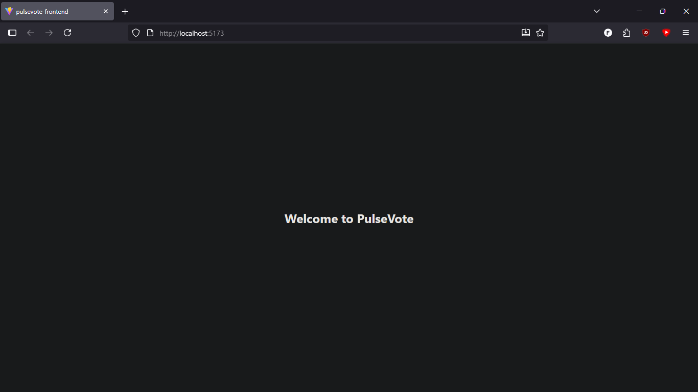
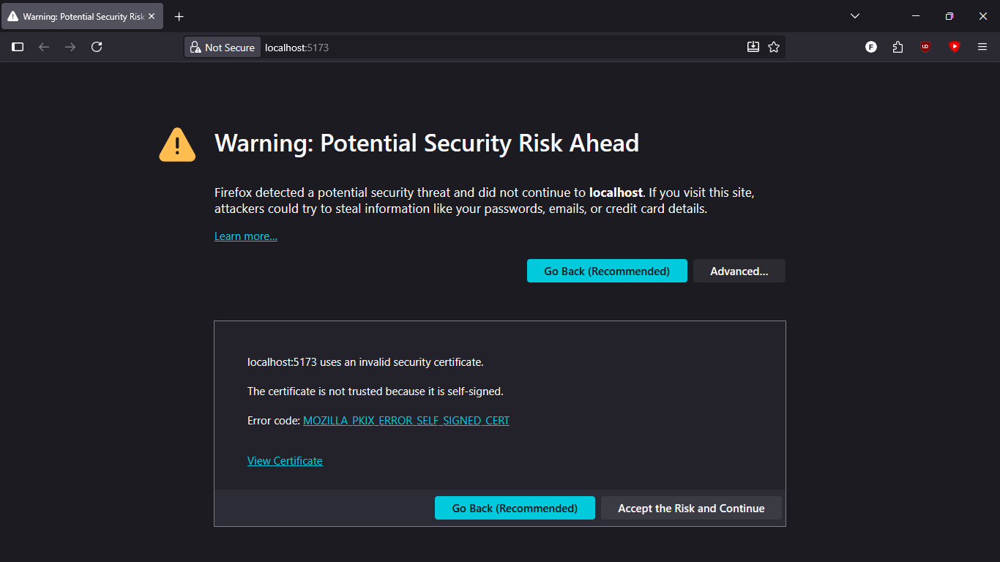
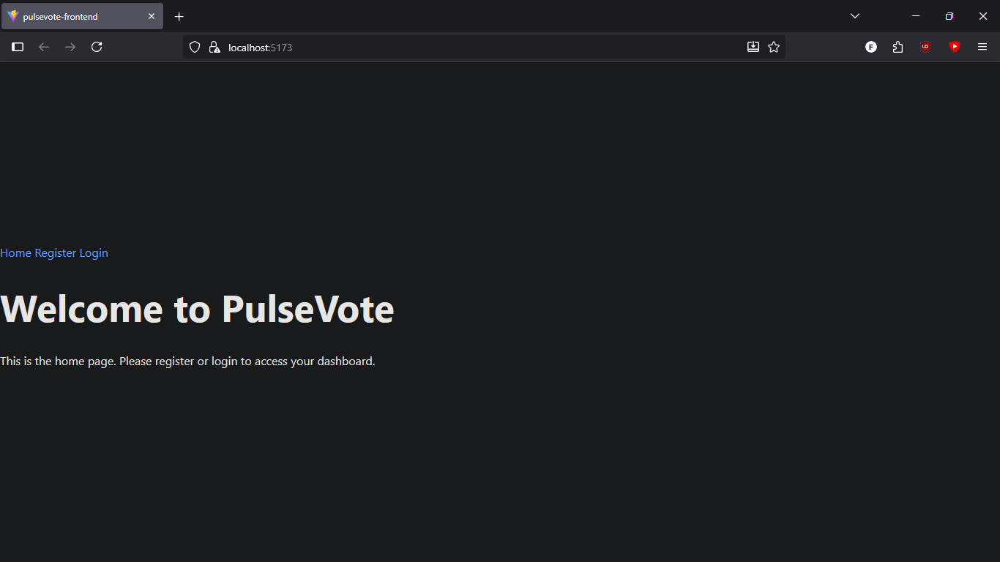
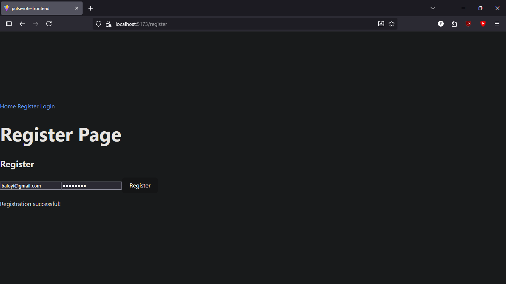
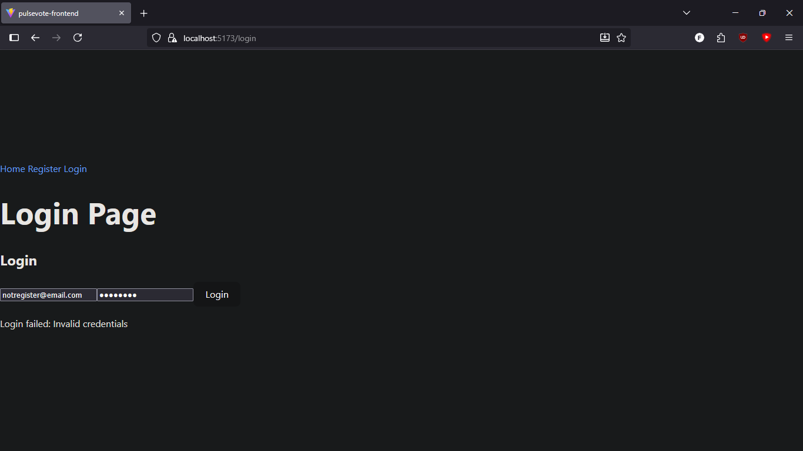
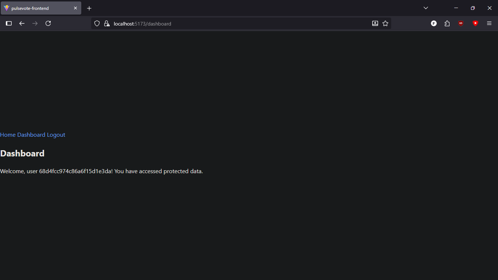
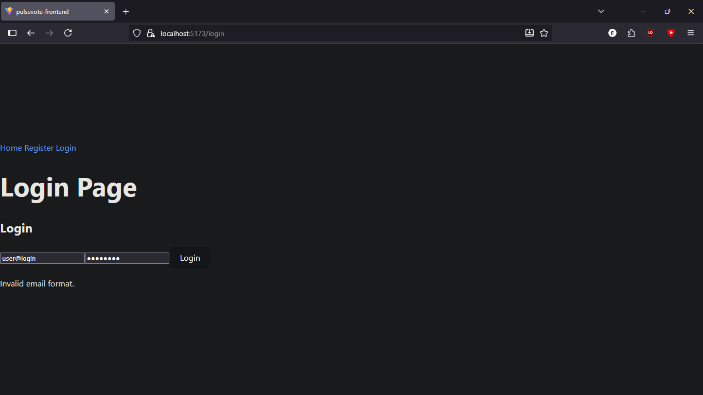
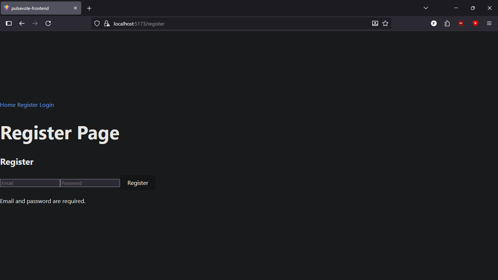
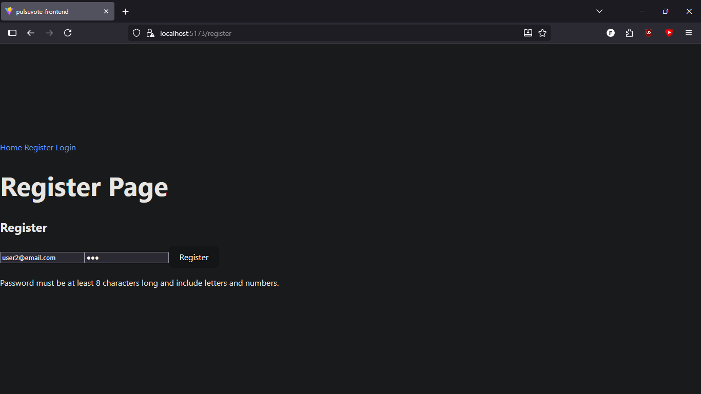

# PulseVote Frontend

---

## 01 – Setting up Foundations
✅ Evidence: Frontend React app running successfully in the browser.  

---

## 02 - Adding SSL
✅ Evidence: Frontend accessible over HTTPS.  

[02_terminal_run.png](02_terminal_run.png)

---

## 04 - Adding Authentication on the Frontend
✅ Evidence: Frontend pages and navigation updated based on login state.  
- **Home page when not logged in**  
  
- **Successful registration**  
  
- **Successful login**  
  
- **Failed login attempt**  
  
- **Dashboard accessible after login**  

---

## 05 - Securing your login
✅ Evidence: Validation checks on login and register forms.  
- **Invalid login email**  
  
- **Invalid login password**  
  
- **Register form with empty fields**  
  
- **Register with invalid email**  
  
- **Register with weak password**  

